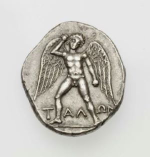

# Talos

A Discord bot for Fxhash NFTs ownership verification and redeeming.  
It is quite an opiniated bot; please read the `Overview` section to understand the key principles.

You are of course free to change any of its functioning if you're ready to dive into the code.

### Some Features

- No blind signing
- Multiple wallets per Discord user  
- Google Sheets as database
- Included templates for Discord pinned messages
- Heroku ready with a bot land page

### Requirements

- a code editor and a terminal
- Node.js
- Google account
- Discord account

[OVERVIEW](./doc/overview.md)  
[SETUP](./doc/setup.md)

---

### Disclaimer  
This is a public version of a private Talos. For a clearer code and files structure, quite a bit of renaming and moving things around have occured. 
This version has not yet been fully tested.  
Do not hesitate to reach out if you find a bug!

Talos coin from Phaistos, Crete, c. 300/280-270 BCE  